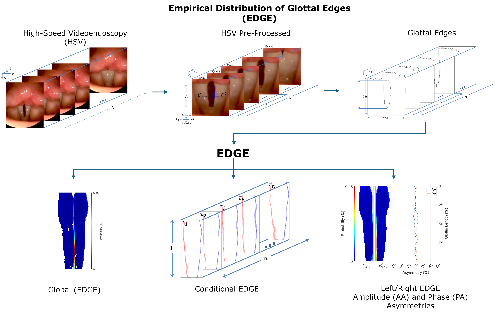

# Supplementary Materials for Empirical Distribution of Glottal Edges (EDGE): A Statistical Assessment of Vocal Fold Kinematics Using High-Speed Videoendoscopy

This repository contains supplementary materials for the paper titled "Empirical Distribution of Glottal Edges (EDGE): A Statistical Assessment of Vocal Fold Kinematics Using High-Speed Videoendoscopy"
## Cite as:
Ibarra EJ, Galindo GE, Alzamendi GA, Cortes JP, Castro C, Manriquez R, Testart A, Zanartu M. Empirical Distribution of Glottal Edges (EDGE): A Statistical Assessment of Vocal Fold Kinematics Using High-Speed Videoendoscopy. IEEE J Biomed Health Inform. 2024. doi: 10.1109/JBHI.2024.3462632.

* Empirical Distribution of Glottal Edges (EDGE) is a statistical method for assessing vocal fold
kinematics using High-Speed Videoendoscopy (HSV). This method includes HSV preprocessing
and glottal edge detection to estimate global EDGE, conditional EDGE, and left/right EDGE. From
these latter two representations, the phase asymmetry (PA) and amplitude asymmetry (AA)
between the left and right vocal folds along the anterior-posterior glottal axis are calculated,
respectively.*

# Supplementary Materials

## Videos:

- [FN01.mp4](https://github.com/Emiroji/Empirical-Distribution-of-Glottal-Edges-EDGE-/blob/main/Videos/FN01.mp4)
- [FN02.mp4](https://github.com/Emiroji/Empirical-Distribution-of-Glottal-Edges-EDGE-/blob/main/Videos/FN02.mp4)
- [FP03.mp4](https://github.com/Emiroji/Empirical-Distribution-of-Glottal-Edges-EDGE-/blob/main/Videos/FP03.mp4)
- [FP04.mp4](https://github.com/Emiroji/Empirical-Distribution-of-Glottal-Edges-EDGE-/blob/main/Videos/FP04.mp4)
- [FP05.mp4](https://github.com/Emiroji/Empirical-Distribution-of-Glottal-Edges-EDGE-/blob/main/Videos/FP05.mp4)
- [FP06.mp4](https://github.com/Emiroji/Empirical-Distribution-of-Glottal-Edges-EDGE-/blob/main/Videos/FP06.mp4)
- [FP07.mp4](https://github.com/Emiroji/Empirical-Distribution-of-Glottal-Edges-EDGE-/blob/main/Videos/FP07.mp4)
- [FP08.mp4](https://github.com/Emiroji/Empirical-Distribution-of-Glottal-Edges-EDGE-/blob/main/Videos/FP08.mp4)

## Figures:

These figures show the results of vibratory asymmetry for the remaining subjects that were not included in Fig. 7 of the paper. For reference, Fig. 7 in the paper illustrates the results for the first eight subjects, while the remaining subjects are illustrated here.

-[Figures_EDGE_for remain_Normal_MTD_VFNs_cases.pdf](https://github.com/Emiroji/Empirical-Distribution-of-Glottal-Edges-EDGE-/blob/main/Figures_EDGE_for%20remain_Normal_MTD_VFNs_cases.pdf)

## Tables:
These tables (Tables II, III, and IV) provide additional data and results related to the subjects discussed in the main paper. For reference, the main paper includes a subset of the data, and the full set of results is included here in the supplementary material.
- [Tables.pdf](https://github.com/Emiroji/Empirical-Distribution-of-Glottal-Edges-EDGE-/blob/main/Tables_II_III_and_IV.pdf)

